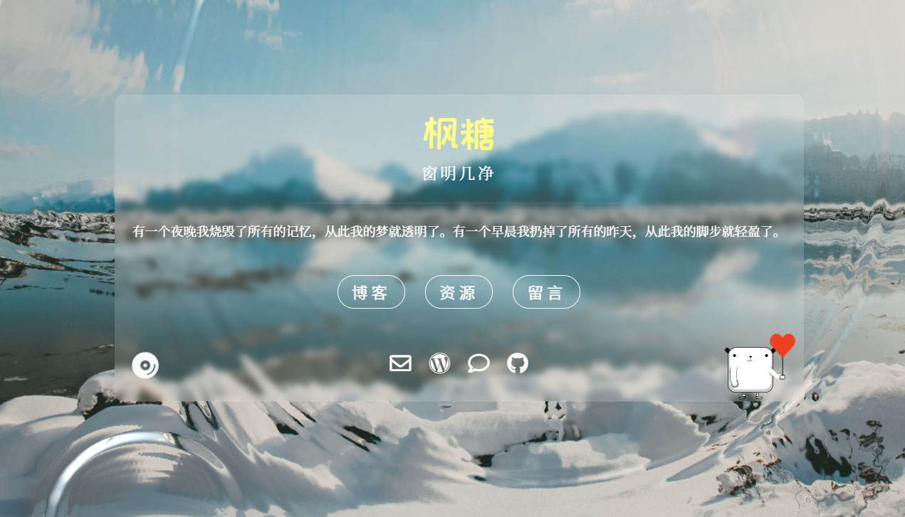
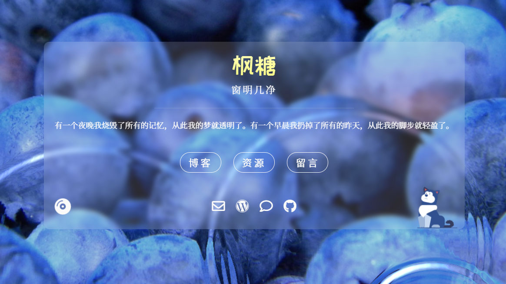
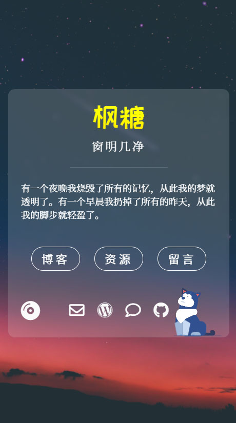

### 描述（Description）

一个简单的主页生成器。A simple home page generator.

### 使用

1.安装依赖。

```shell
npm install
```

2.编辑根目录和主题目录的`config.yml`。

3.生成静态网页。

```shell
gulp
```

4.部署`dist`文件夹中的内容到网站目录。

### 主题：a-glass-of-water

枫糖空灵风格的主页：[maplesugar.top](https://maplesugar.top)。

- 水波纹背景。Ripple background with random pic, and fade background with random pic on phone.
- 音乐自动播放。Audio you love autoplaying.
- 目前有三个宠物可选。Three lovely puppets.







### 主题：dev-landing-page

为了测试主题功能，整合的一个主页：[dev-landing-page](https://github.com/flexdinesh/dev-landing-page)。
